# BELLA VISTA - Hotel Booking App

Bella Vista is a responsive hotel booking web application designed for users seeking a smooth and intuitive experience when reserving accommodation. Built with Django, the site allows users to register, book hotel rooms, and manage their bookings entirely online.

The app is ideal for travellers who want to check availability and secure their reservations without having to call or email. It provides personalized functionality such as booking history, editing reservations, and user authentication for privacy and security.

The live link can be found here - https://hotel-booking-app-anthony-310db2860612.herokuapp.com/

## Responsive Layout

### Website across all screen sizes

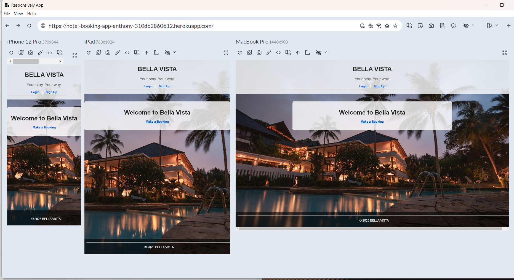

---

## Features

### Existing Features

- **Navigation Bar**
  - Present on all pages with links to login, signup, make a booking, view bookings, and logout.
  - Adjusts based on authentication status.


- **Homepage**
  - A visually appealing landing section with a hotel-themed background image and “Make a Booking” CTA button.
  - Welcomes users with a clear value proposition.

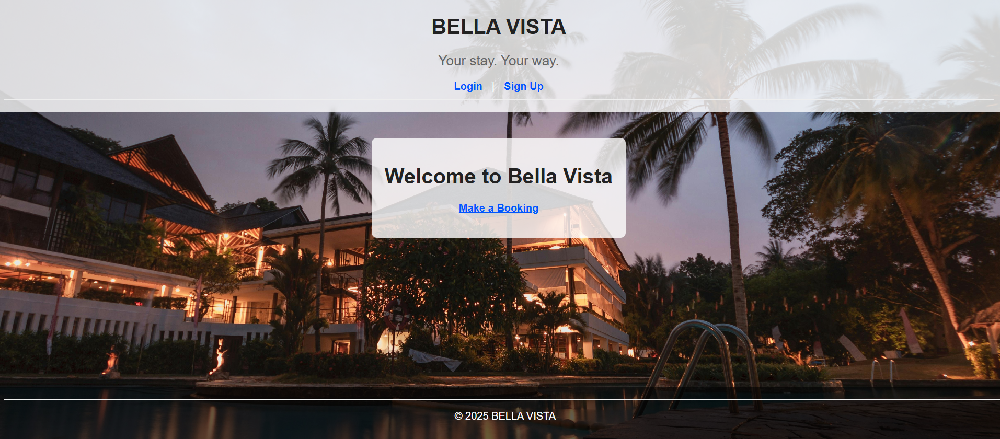

- **User Authentication**
  - Users can register, log in, and log out using Django Allauth.
  - Protected routes ensure users only manage their own bookings.

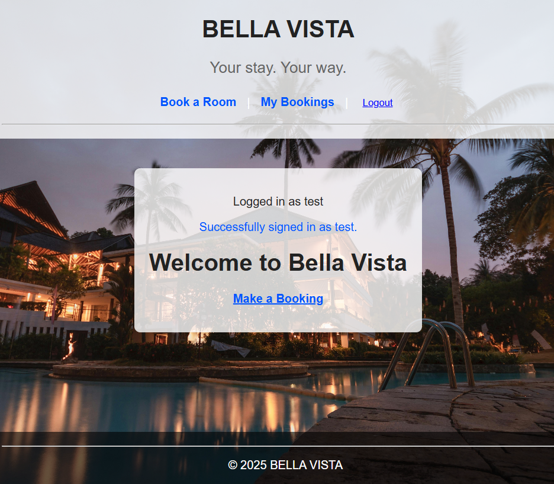

- **Booking Form**
  - Users can book a room with details like name, check-in/check-out dates, room type and a text box for special requests(crib etc).
  - The form includes date validation (e.g. check-in cannot be after check-out).

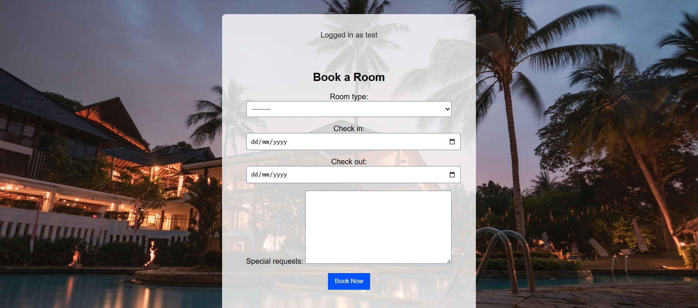

- **Booking Success Page**  
  - Confirmation message shown after a valid booking submission.
  
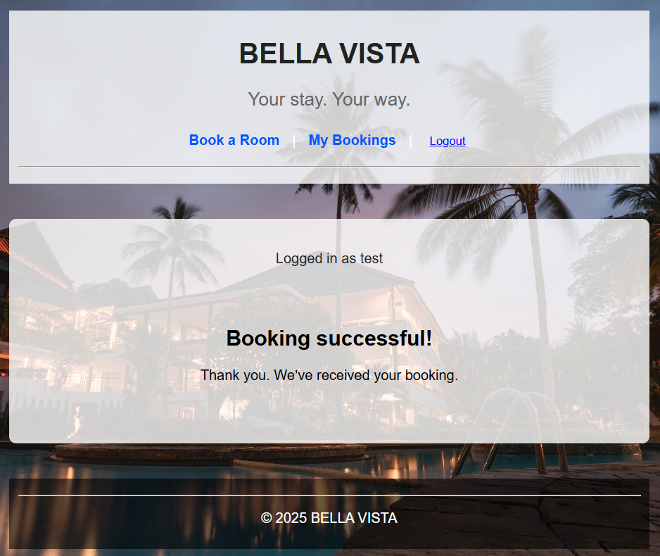


- **My Bookings Page**
  - Shows only the logged-in user’s bookings.
  - Includes options to edit or delete each booking.

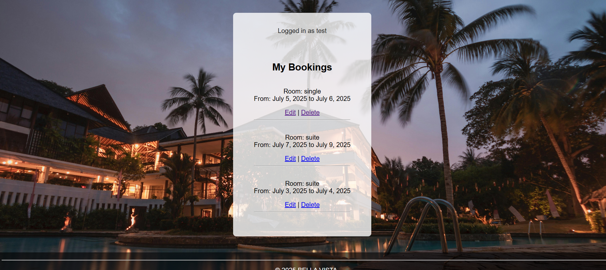

- **Edit/Delete Booking**
  - Users can update their booking information or delete it entirely.
  - Validation and confirmation messages are displayed accordingly.

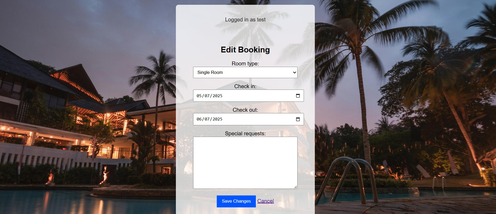
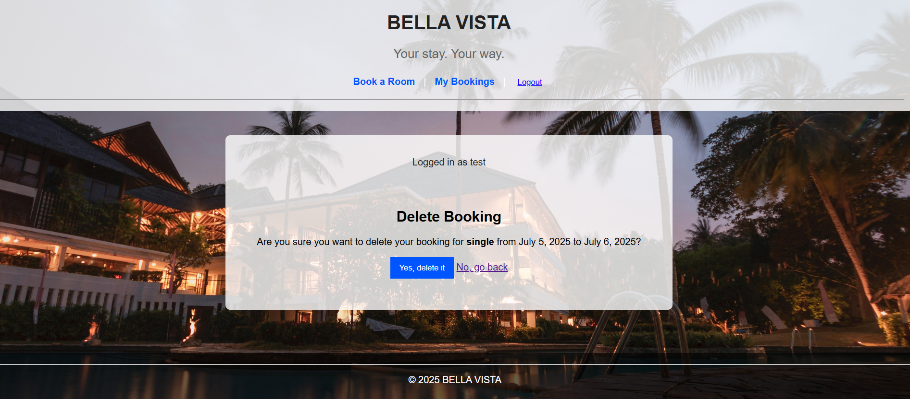


- **Admin Panel**
  - Site admin can manage all bookings via Django admin interface.
  - Filter user bookings using email and full name given.
  - Edit (add special requests) or delete user bookings (with confirmation before final deletion).

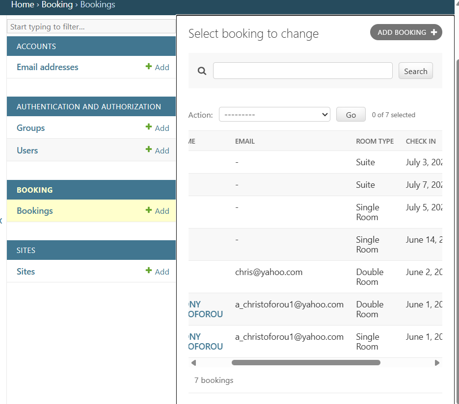

- **Responsive Layout**
  - Optimized for mobile, tablet, and desktop using Responsively App and browser dev tools.

## Data Model

The core of the application is the `Booking` model, which stores individual reservation details.

Each booking instance includes:

- `user` – a ForeignKey to Django's built-in User model
- `full_name`
- `email`
- `room_type` – a choice field (e.g., Single, Double, etc.)
- `check_in` and `check_out` dates
- `created_on` timestamp (auto-generated)

This model is used across views to create, display, update, and delete bookings securely and ensures that only the authenticated user who created a booking can manage it.


### Features Left to Implement

- Confirmation email on successful booking.
- Room availability checker to prevent double booking.
- The password reset page now uses a custom template consistent with the rest of the site, although submission still returns a server error (500).

  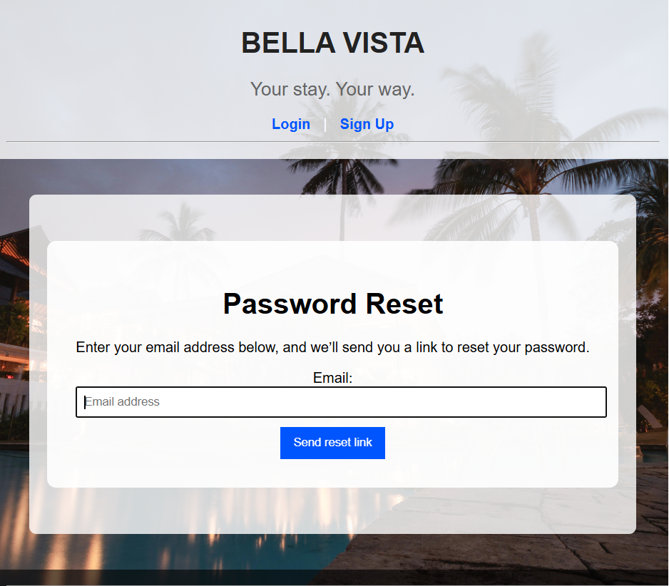


---

## Testing

### Manual Testing

Manual testing was conducted across all user journeys including:

- Homepage load
- User registration and login/logout
- Booking form submission (valid/invalid)
- My Bookings list
- Edit/Delete functionality
- Access restriction (unauthenticated and unauthorized access)
- Responsive behavior across devices

All features were tested manually in Chrome and on Responsively App across desktop, tablet, and mobile breakpoints.

Test outcomes and step-by-step logs are documented in [TESTING.md](TESTING.md), with screenshots showing the results of each test case and feature verification.

## Bugs

### Solved Bugs

- **Footer overlap issue**:  
  Fixed by removing `position: absolute` and ensuring the `.wrapper` had `min-height: 100%`.

- **Check-out before check-in validation**:  
  Custom validation was added to prevent form submission when the check-out date is earlier than the check-in date.

- **Edit form duplicate validation messages**:  
  Resolved by manually rendering each form field instead of using `{{ form.as_p }}` to avoid displaying duplicate error messages.

### Known Bug (Unresolved)

- **Password reset form returns 500 error on submission**:  
  The password reset page renders correctly, but submitting a valid user email triggers a server error (500).  
  Due to time constraints and the default behaviour of Django Allauth, this issue remains unresolved and is documented in the testing section.


---

## Validator Testing

- **HTML**:  
  All public-facing templates passed W3C validation without warnings or errors.  
  Screenshots of successful HTML validation for all key pages are included in the [TESTING.md](TESTING.md) file.

- **CSS**:  
  Background image, color contrast, and layout were visually verified for accessibility and clarity.

- **JavaScript**:  
  No custom JavaScript was written for this project.  
  All `.js` files are auto-generated by Django’s admin and Allauth systems during `collectstatic`.

- **Python / PEP8**:  
  All Python code passed validation using [pep8ci.herokuapp.com](https://pep8ci.herokuapp.com/).  
  String length, indentation, and whitespace issues were corrected using `black` and manual adjustments.

## Lighthouse Performance Report

The [Google Lighthouse](https://developers.google.com/web/tools/lighthouse) tool was used to evaluate the live site's performance, accessibility, best practices, and SEO.

The results were excellent across all key categories:

| Metric           | Score |
|------------------|-------|
| Performance      | 98    |
| Accessibility    | 100   |
| Best Practices   | 93    |
| SEO              | 90    |

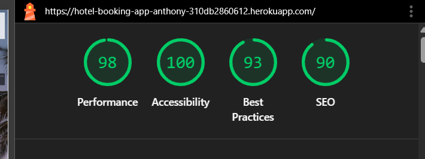

These scores confirm that the app is highly optimized for speed, accessibility, and best web development practices across devices.


---

## Deployment

The site was deployed using [Heroku](https://heroku.com), with the following configuration and steps:

### Initial Setup

- Created a `requirements.txt` file using `pip freeze > requirements.txt`.
- Created a `Procfile` with the line `web: gunicorn [project_name].wsgi` (replace `[project_name]` with your Django project folder).
- Configured `settings.py` to read the database from `DATABASE_URL` using `dj_database_url`.
- Set `DEBUG = False` and updated `ALLOWED_HOSTS` with the Heroku domain.

### Cloudinary Setup

- Media files are stored using [Cloudinary](https://cloudinary.com/).
- Installed `cloudinary` and configured `MEDIA_URL` and `DEFAULT_FILE_STORAGE` in `settings.py`.
- Added Cloudinary environment variables in Heroku Config Vars.

### GitHub and Heroku Integration

- Linked the GitHub repository to Heroku via the Heroku dashboard.
- Enabled automatic deployment from the `main` branch.
- Configured `DISABLE_COLLECTSTATIC=1` in Heroku Config Vars (optional, for easier deployment during development).
- Run initial migrations and create superuser using the Heroku CLI.

### Final Deployment URL

The live application can be accessed at:  
👉 [https://hotel-booking-app-anthony-310db2860612.herokuapp.com/](https://hotel-booking-app-anthony-310db2860612.herokuapp.com/)

---

### Steps for Deployment

1. **Fork or clone this repository** to your local machine.
2. **Create a new Heroku app** from your Heroku dashboard.
3. **Set the buildpacks** to Python and NodeJS (Python should be first).
4. **Link the Heroku app** to your GitHub repository.
5. **Set Heroku Config Vars**:
   - `DATABASE_URL`
   - `CLOUDINARY_URL`
   - `SECRET_KEY`
   - `DISABLE_COLLECTSTATIC` (optional)
6. **Deploy the app** via the Heroku dashboard.
7. **Run migrations and create superuser** via the Heroku CLI:
   ```bash
   heroku run python manage.py migrate
   heroku run python manage.py createsuperuser
   ```

---

## Entity Relationship Diagram (ERD)

The following ERD represents the relationship between users and their bookings in the Bella Vista hotel app:

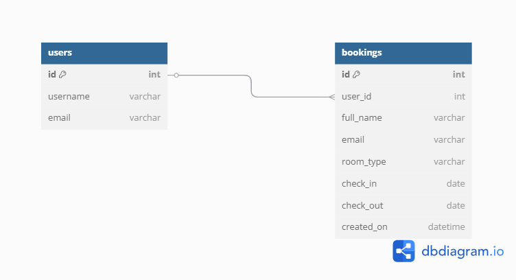
This diagram was created using [dbdiagram.io](https://dbdiagram.io).


## Credits

- **Code Institute** – For the project structure, guidance, and deployment walkthroughs.
- **Django Allauth** – For handling user authentication and account management functionality.
- **Cloudinary** – For providing cloud-based media storage and image handling.
- **Responsively App** – Used to capture responsive layout previews across devices.
- **W3C Validator** – Used to verify HTML and CSS compliance.
- **pep8ci.herokuapp.com** – Used for Python PEP8 code validation.
- **dbdiagram.io** – Used to design and visualize the Entity Relationship Diagram.
- **Mentor, Moritz Wach** – For insightful guidance and support throughout the project, especially during initial layout ideas, debugging and validation.
- **Stack Overflow & Django Docs** – For code snippets, troubleshooting, and documentation references during development.
- **Pexels Images** – For the background image used in the site design (https://www.pexels.com/photo/palm-trees-at-night-258154/).
- **YouTube Tutorials** – Various videos were consulted to assist with debugging Django issues, configuring PostgreSQL, and setting up the Heroku deployment pipeline.


### Content

- All content was custom written to simulate a realistic hotel booking workflow.
- Django documentation and Stack Overflow were referenced for form validation and authentication logic.


### Media

- Background image used across the app: [Pexels](https://pexels.com/)

---

